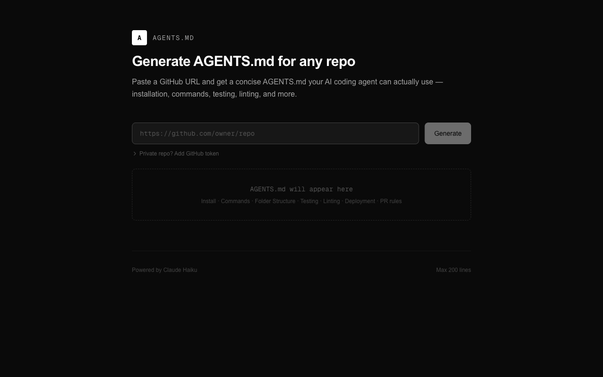

# AGENTS.md Generator

[](https://github.com/davidcjw/agents-md-generator/actions/workflows/ci.yml)


[](https://agentready.davidcjw.com/results/davidcjw/agents-md-generator)

[`AGENTS.md`](https://agents.md) is the emerging standard for telling AI coding agents how to work in your repo — and this tool generates one for any public GitHub repository in seconds, using Claude AI.

**Live:** [agents-md-generator.davidcjw.com](https://agents-md-generator.davidcjw.com)

<p align="center">
  
</p>

## What it does

Paste a GitHub URL → get a concise, accurate `AGENTS.md` (≤200 lines) covering only the sections that have real evidence in the repo:

- Installation / Setup
- Executable Commands
- Folder Structure
- Testing Instructions
- Linting
- Deployment
- PR Instructions
- Coding Guidelines
- Do-Not Rules
- Styling Guide

Output is editable in the browser and can be copied or downloaded.

## How it works

1. `/api/github` fetches key files from the repo in priority order (README → package.json → lint/test configs → CI workflows etc.), capped at 24k characters
2. The context is sent to `claude-haiku-4-5-20251001` with a structured prompt
3. Claude generates only sections backed by real evidence — no generic filler
4. Output is hard-capped to 200 lines

## Self-hosting

### Prerequisites

- Node.js 18+
- An [Anthropic API key](https://console.anthropic.com/)

### Local development

```bash
git clone https://github.com/davidcjw/agents-md-generator
cd agents-md-generator
npm install
cp .env.example .env.local   # add your ANTHROPIC_API_KEY
npm run dev
```

Open [http://localhost:3000](http://localhost:3000).

### Deploy to Vercel

[](https://vercel.com/new/clone?repository-url=https://github.com/davidcjw/agents-md-generator)

Set the `ANTHROPIC_API_KEY` environment variable in your Vercel project settings.

## Private repos

Expand "Private repo? Add GitHub token" in the UI and provide a GitHub personal access token with `repo` scope.

## Tech stack

- [Next.js](https://nextjs.org) (App Router)
- [Tailwind CSS](https://tailwindcss.com)
- [Anthropic SDK](https://github.com/anthropic-ai/sdk-python) — `claude-haiku-4-5-20251001`

## Contributing

Contributions are welcome! Please open an issue first to discuss what you'd like to change.

1. Fork the repo
2. Create a feature branch (`git checkout -b feature/your-feature`)
3. Commit your changes (`git commit -m 'feat: describe change'`)
4. Push and open a pull request

Please make sure tests pass before submitting a PR.

## Code of Conduct

This project follows the [Contributor Covenant v2.1](https://www.contributor-covenant.org/version/2/1/code_of_conduct/).
By participating you agree to uphold a welcoming, harassment-free environment.

## License

Distributed under the MIT License. See [LICENSE](LICENSE) for details.
